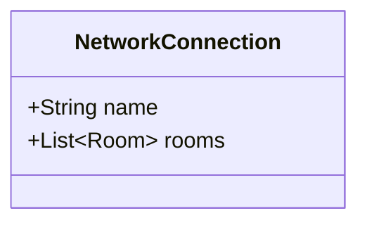
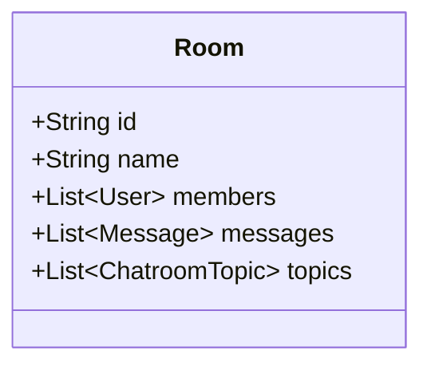
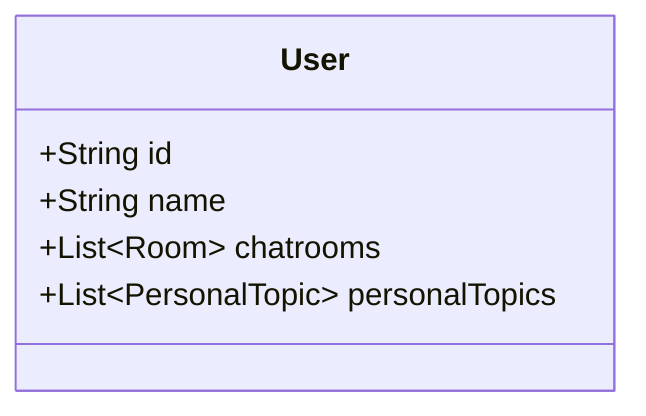
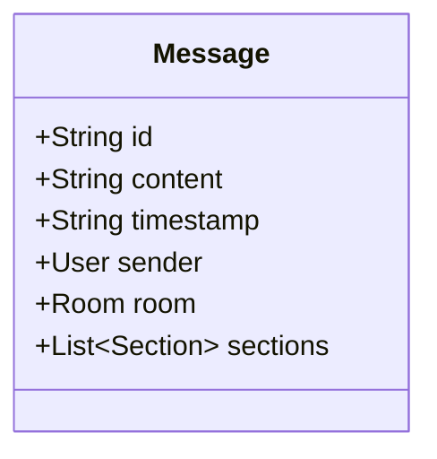
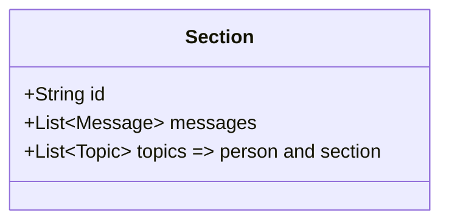
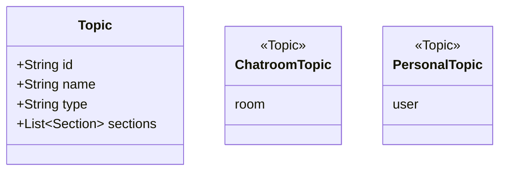
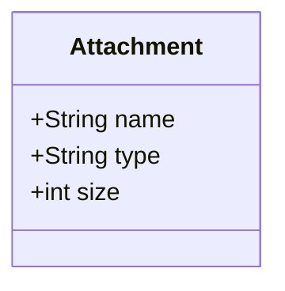
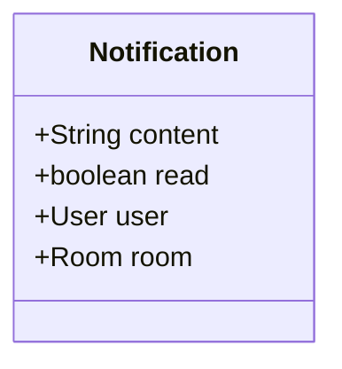
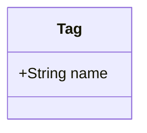
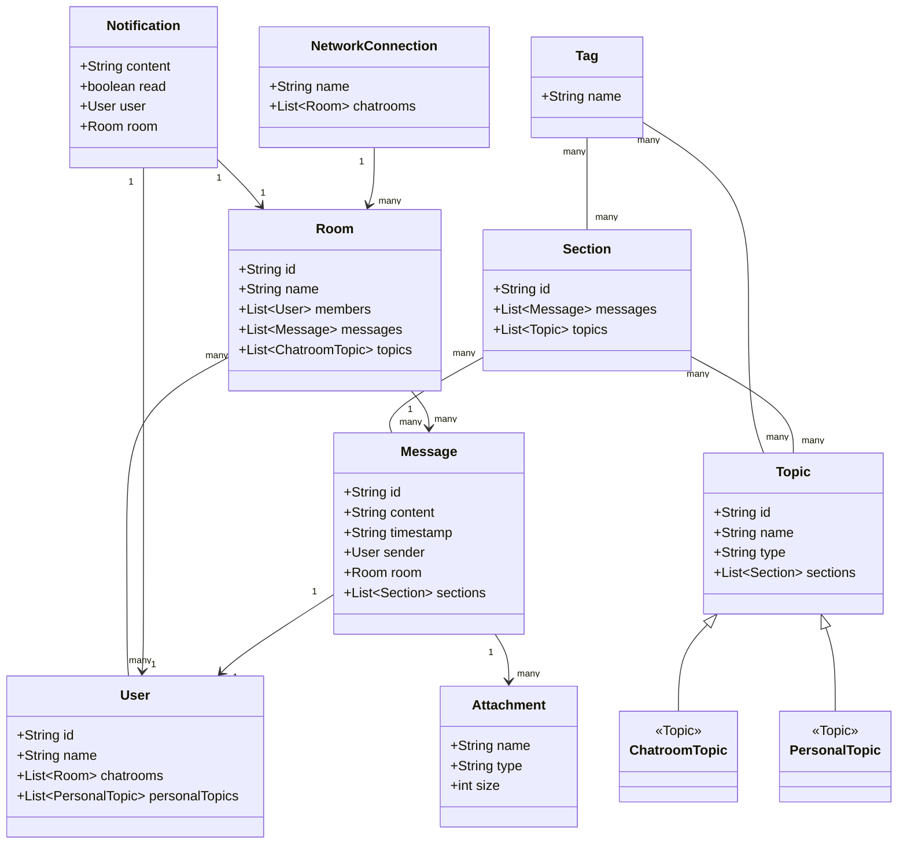

# Class diagram

此專案的 UML class diagram 如下：

（內容由 ChatGPT 生成草稿，現正依照需求修改中）

串連的帳號

```mermaid
classDiagram
    class NetworkConnection {
        +String name
        +List~Room~ rooms
    }
```

聊天室

```mermaid
classDiagram
    class Room {
        +String id
        +String name
        +List~User~ members
        +List~Message~ messages
        +List~ChatroomTopic~ topics
    }
```

用戶

```mermaid
classDiagram
    class User {
        +String id
        +String name
        +List~Room~ chatrooms
        +List~PersonalTopic~ personalTopics
    }
```

訊息

```mermaid
classDiagram
    class Message {
        +String id
        +String content
        +String timestamp
        +User sender
        +Room room
        +List~Section~ sections
    }
```

訊息段

```mermaid
classDiagram
    class Section {
        +String id
        +List~Message~ messages
        +List~Topic~ topics => person and section
    }
```

話題

```mermaid
classDiagram
    class Topic {
        +String id
        +String name
        +String type
        +List~Section~ sections
    }
    class ChatroomTopic {
        <<Topic>>
        room
    }
    class PersonalTopic {
        <<Topic>>
        user
    }
```

附件 (backlog)

```mermaid
classDiagram
    class Attachment {
        +String name
        +String type
        +int size
    }
```

```mermaid
classDiagram
    class Notification {
        +String content
        +boolean read
        +User user
        +Room room
    }
```

標籤 (?)

```mermaid
classDiagram
    class Tag {
        +String name
    }
```

---

```mermaid
classDiagram
    class NetworkConnection {
        +String name
        +List~Room~ chatrooms
    }

    class Room {
        +String id
        +String name
        +List~User~ members
        +List~Message~ messages
        +List~ChatroomTopic~ topics
    }
    NetworkConnection "1" --> "many" Room

    class User {
        +String id
        +String name
        +List~Room~ chatrooms
        +List~PersonalTopic~ personalTopics
    }
    User "many" -- "many" Room

    class Message {
        +String id
        +String content
        +String timestamp
        +User sender
        +Room room
        +List~Section~ sections
    }
    Room "1" --> "many" Message
    Message "1" --> "1" User

    class Section {
        +String id
        +List~Message~ messages
        +List~Topic~ topics
    }
    Section "many" -- "many" Message

    class Topic {
        +String id
        +String name
        +String type
        +List~Section~ sections
    }
    Section "many" -- "many" Topic
    class ChatroomTopic {
        <<Topic>>
    }
    class PersonalTopic {
        <<Topic>>
    }
    Topic <|-- ChatroomTopic
    Topic <|-- PersonalTopic

    class Attachment {
        +String name
        +String type
        +int size
    }
    Message "1" --> "many" Attachment

    class Notification {
        +String content
        +boolean read
        +User user
        +Room room
    }
    Notification "1" --> "1" User
    Notification "1" --> "1" Room

    class Tag {
        +String name
    }
    Tag "many" -- "many" Section
    Tag "many" -- "many" Topic
```
