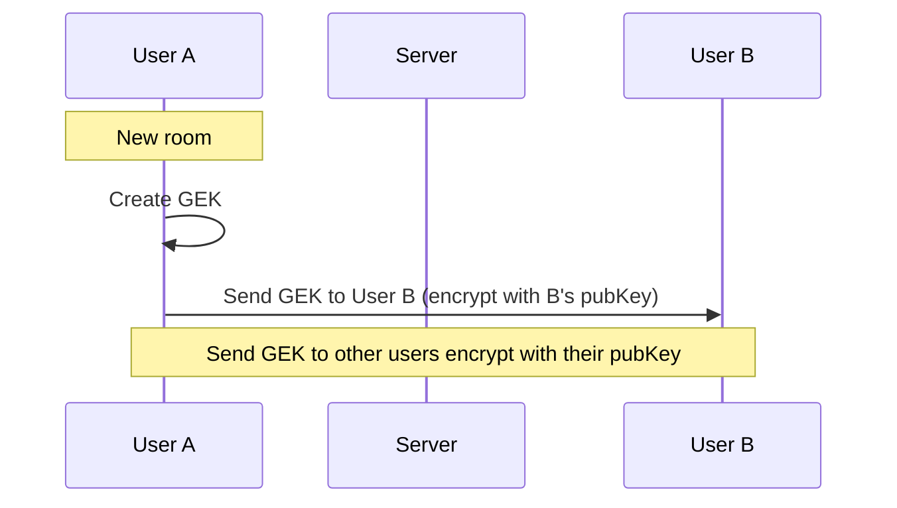
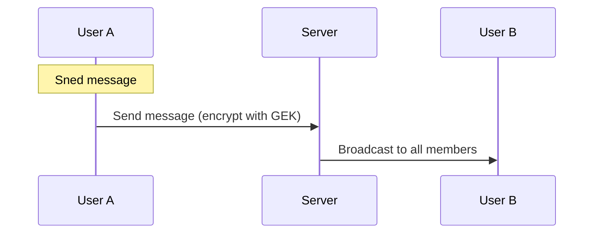
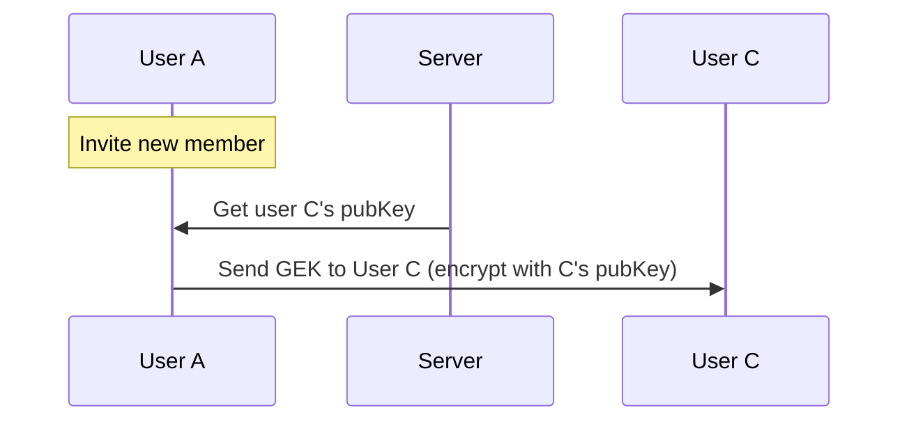
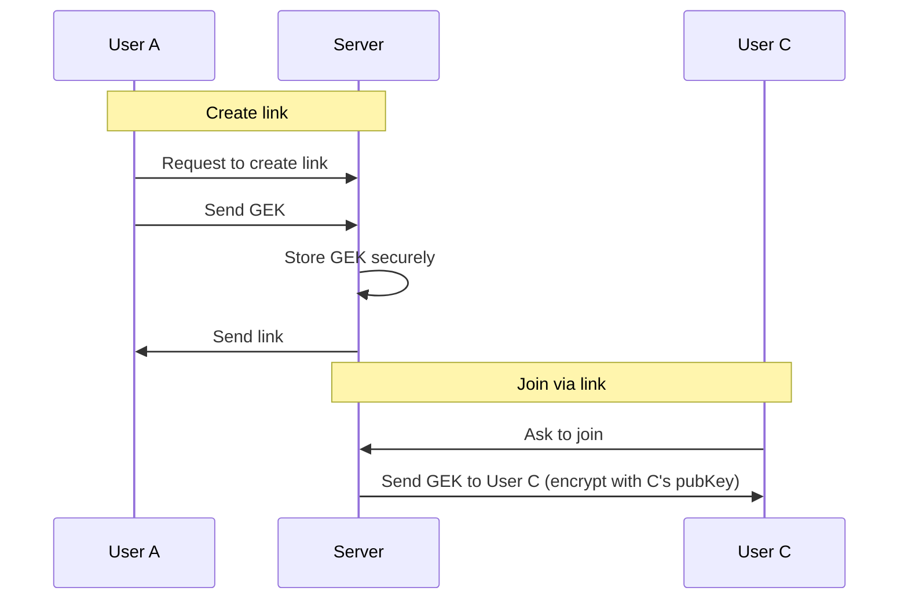
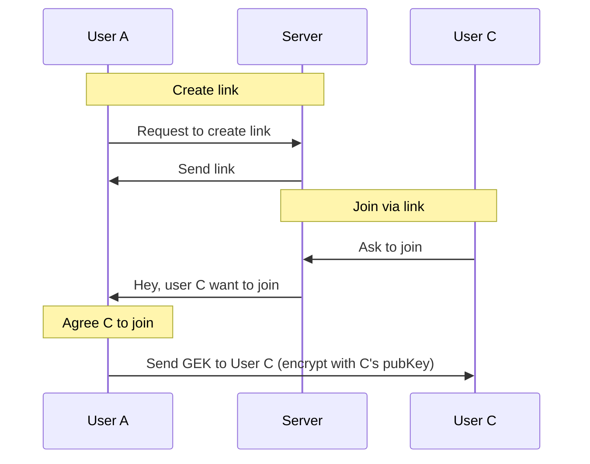

# Data Flow

Client 與 Server 間的資料傳輸模式。

## Overview

訊息傳送主要分成兩種模式：

- 即焚模式（Ephemeral Mode）：伺服器只進行轉發
- 備份模式（Backup Mode）：伺服器除了轉發，亦同時進行備份

不論是何種模式，皆為加密傳輸及儲存。

## 即焚模式 Ephemeral mode

使用即焚模式（Ephemeral mode）時，伺服器只會進行訊息轉發，不會儲存聊天紀錄於資料庫中。

即焚模式的聊天紀錄僅儲存於用戶本地端，於用戶本地端之間同步、自動刪除等。

即焚模式的訊息傳遞，使用「群組即焚密鑰（Group Ephemeral Key，以下簡稱 GEK）」進行加密。

### 新聊天室

### 傳訊息

### 邀請新成員加入

### 使用連結加入

管理員（或其他有建立邀請連結權限的成員）於建立邀請連結時，可以選擇下列選項：

- 加入批准（boolean）：使用者需經過管理員批准同意後，才可加入聊天室

- 讓伺服器代管金鑰（boolean）：讓伺服器代管 GEK，以讓新成員在所有成員皆為離線狀態時，也能夠透過伺服器分派 GEK 而得以順利加入，不需透過現有成員進行派發。

「加入批准」選項若為 True，則「讓伺服器代管金鑰」設為 False 且 Disabled（因為新成員需等待現有成員上線並批准，因此無伺服器代管 GEK 的必要）

#### 伺服器代管 GEK

#### 伺服器不代管 GEK

## 備份模式 Backup mode
