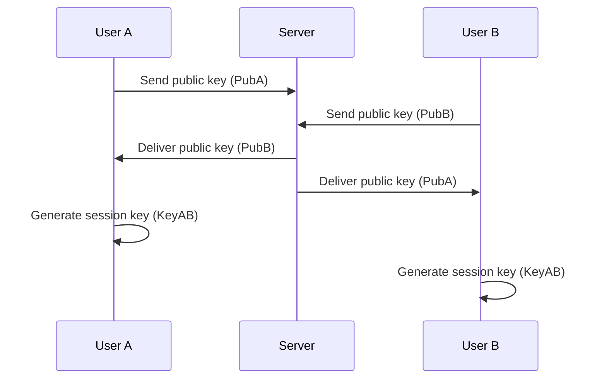

# Data Flow

Client 與 Server 間的資料傳輸模式。

## Overview

訊息傳送主要分成兩種模式：

- 即焚模式（Ephemeral Mode）：伺服器只進行轉發
- 備份模式（Backup Mode）：伺服器除了轉發，亦同時進行備份

不論是何種模式，皆為加密傳輸及儲存。

## Mermaid test

下面這個圖表是 Mermaid 測試用圖表：

