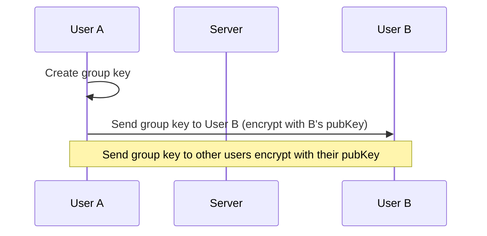

import Tabs from '@theme/Tabs';
import TabItem from '@theme/TabItem';

# Data Flow

Client 與 Server 間的資料傳輸模式。

## Overview

訊息傳送主要分成兩種模式：

- 即焚模式（Ephemeral Mode）：伺服器只進行轉發
- 備份模式（Backup Mode）：伺服器除了轉發，亦同時進行備份

不論是何種模式，皆為加密傳輸及儲存。

### 即焚模式 Ephemeral mode

使用即焚模式（Ephemeral mode）時，伺服器只會進行訊息轉發，不會儲存聊天紀錄於資料庫中。

即焚模式的聊天紀錄僅儲存於用戶本地端，於用戶本地端之間同步、自動刪除等。

即焚模式的訊息傳遞，使用「群組密鑰」（Group Key）進行加密。

### 備份模式 Backup mode

使用備份模式（Backup mode）時，伺服器在收到新訊息時，除了轉發給其他成員，也會儲存至資料庫。

備份模式的訊息傳遞及儲存，皆使用「群組密鑰」（Group key）進行加密。與即焚模式（Ephemeral mode）不同的是，備份模式的群組金鑰在輪轉（rotation）之後，舊的金鑰仍會儲存於鑰匙圈（key chain）之中，後續解密歷史訊息時仍會使用到舊的 key。

新成員加入時，依據設定的新成員可存取歷史時間範圍，給予對應的鑰匙，即可控制新成員的閱覽範圍。

## Data flow

### Create new room



### Send message

<Tabs>
  <TabItem value="ephemeral" label="Ephemeral mode" default>
    ```mermaid
    sequenceDiagram
        participant User A
        participant Server
        participant User B

        User A->>Server: Send message (encrypt with group key)
        Server->>User B: Broadcast to all members
    ```
  </TabItem>
  <TabItem value="backup" label="Backup mode">
    ```mermaid
    sequenceDiagram
        participant User A
        participant Server
        participant Database
        participant User B

        User A->>Server: Send message (encrypt with group key)
        Server->>Database: Store encrypted message and metadata
        Server->>User B: Send encrypted message to all members
    ```
  </TabItem>
</Tabs>

### 邀請新成員加入

<Tabs>
  <TabItem value="ephemeral" label="Ephemeral mode" default>
    ```mermaid
    sequenceDiagram
        participant User A
        participant Server
        participant User C

        Server->>User A: Get user C's pubKey
        User A->>User C: Send group key to User C (encrypt with C's pubKey)
    ```
  </TabItem>
  <TabItem value="backup" label="Backup mode">
    ```mermaid
    sequenceDiagram
        participant User A
        participant Server
        participant User C

        Server->>User A: Get user C's pubKey
        User A->>User C: Send group key to User C (encrypt with C's pubKey)
        User C->>Server: Get Encrypted history data
    ```
  </TabItem>
</Tabs>

### 使用連結加入

管理員（或其他有建立邀請連結權限的成員）於建立邀請連結時，可以選擇下列選項：

- 加入批准（boolean）：使用者需經過管理員批准同意後，才可加入聊天室

- 讓伺服器代管金鑰（boolean）：讓伺服器代管 group key，以讓新成員在所有成員皆為離線狀態時，也能夠透過伺服器分派 group key 而得以順利加入，不需透過現有成員進行派發。

「加入批准」選項若為 True，則「讓伺服器代管金鑰」設為 False 且 Disabled（因為新成員需等待現有成員上線並批准，因此無伺服器代管 group key 的必要）

#### 伺服器代管 group key

<Tabs>
  <TabItem value="ephemeral" label="Ephemeral mode" default>
    ```mermaid
    sequenceDiagram
        participant User A
        participant Server
        participant User C

        note over User A,Server: Create link
        User A->>Server: Request to create link
        User A->>Server: Send group key
        Server->>Server: Store group key securely
        Server->>User A: Send link
        note over Server,User C: Join via link
        User C->>Server: Ask to join
        Server->>User C: Send group key to User C (encrypt with C's pubKey)
    ```
  </TabItem>
  <TabItem value="backup" label="Backup mode">
    ```mermaid
    sequenceDiagram
        participant User A
        participant Server
        participant User C

        note over User A,Server: Create link
        User A->>Server: Request to create link
        User A->>Server: Send group key
        Server->>Server: Store group key securely
        Server->>User A: Send link
        note over Server,User C: Join via link
        User C->>Server: Ask to join
        Server->>User C: Send group key to User C (encrypt with C's pubKey)
        User C->>Server: Get history data
    ```
  </TabItem>
</Tabs>

#### 伺服器不代管 group key

<Tabs>
  <TabItem value="ephemeral" label="Ephemeral mode" default>
    ```mermaid
    sequenceDiagram
        participant User A
        participant Server
        participant User C

        note over User A,Server: Create link
        User A->>Server: Request to create link
        Server->>User A: Send link
        note over Server,User C: Join via link
        User C->>Server: Ask to join
        Server->>User A: Hey, user C want to join
        note over User A: Agree C to join
        User A->>User C: Send group key to User C (encrypt with C's pubKey)
    ```
  </TabItem>
  <TabItem value="backup" label="Backup mode">
    ```mermaid
    sequenceDiagram
        participant User A
        participant Server
        participant User C

        note over User A,Server: Create link
        User A->>Server: Request to create link
        Server->>User A: Send link
        note over Server,User C: Join via link
        User C->>Server: Ask to join
        Server->>User A: Hey, user C want to join
        note over User A: Agree C to join
        User A->>User C: Send group key to User C (encrypt with C's pubKey)
        User C->>Server: Get history data
    ```
  </TabItem>
</Tabs>


